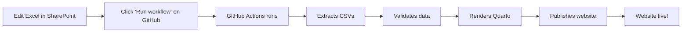

# Quick Start: Website Updates

## For Team Members (Non-Coders)

1. **Edit Excel file** in SharePoint
2. **Go to GitHub:** https://github.com/Big-Life-Lab/phes-ef-scope-private/actions
3. **Click:** "Update Website" → "Run workflow" → Green button
4. **Wait 2-3 minutes**
5. **View site:** https://big-life-lab.github.io/phes-ef-scope-private/

**Full guide:** [UPDATING_WEBSITE.md](../UPDATING_WEBSITE.md)

---

## For Developers

### Local Development
```bash
# Render website locally
cd qmd && quarto preview

# Extract CSVs from Excel
Rscript R/extract_excel_to_csv.R

# Validate data
Rscript R/validate_csv_data.R
```

### Deployment Options
1. **Manual via GitHub Actions** (recommended for team)
2. **Automatic on push** (could enable if desired)
3. **Local render + commit** (traditional approach)

---

## Workflow Summary



**No local software needed!** ✨
